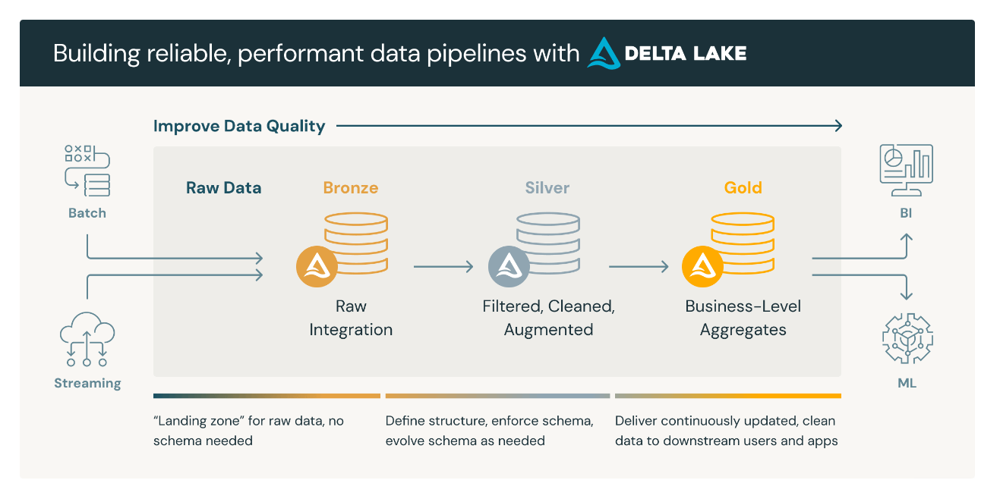
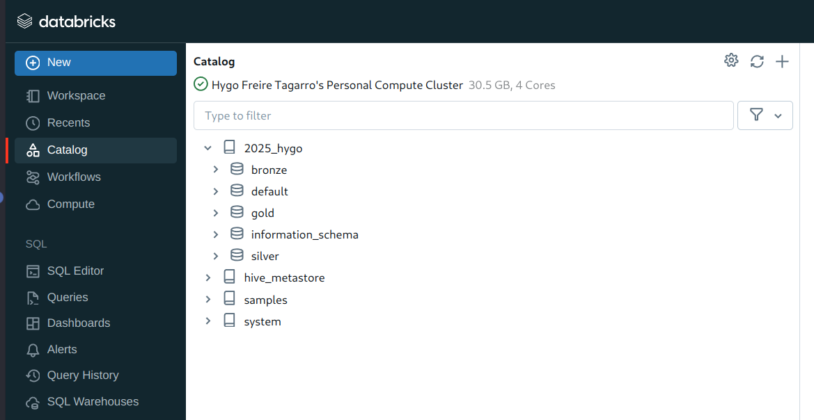

# Índice
1. [Definição do Problema](#definição-do-problema)
2. [Objetivo](#objetivo)
3. [O Projeto](#o-projeto)
   - [1. Pesquisa de Dados](#1-pesquisa-de-dados)
   - [2. Coleta de Dados](#2-coleta-de-dados)
   - [3. Plataforma para Execução das Tarefas](#3-plataforma-para-execução-das-tarefas)
   - [4. Formato e Armazenamento](#4-formato-e-armazenamento)
   - [5. Modelagem e Carregamento](#5-modelagem-e-carregamento)
     - [5.1. Criação dos Esquemas](#5.1-criação-dos-esquemas)
     - [5.2. Criação das Tabelas](#5.2-criação-das-tabelas)
     - [5.3. Extração e Carregamento de Dados para a Camada Bronze](#5.3-extração-e-carregamento-de-dados-para-a-camada-bronze)

## Definição do Problema

## Objetivo

## O Projeto

### 1. Pesquisa de Dados

A pesquisa de dados foi realizada utilizando informações disponíveis no site [Transfermarkt](https://www.transfermarkt.com), que oferece uma ampla gama de filtros para personalizar as estatísticas e classificações de clubes de futebol. Utilizei um conjunto de dados abrangente, extraído das temporadas do Campeonato Brasileiro Série A, cobrindo o período de 2006 a 2024.

**Modelagem**: Utilizei uma arquitetura do tipo [Medallion](https://www.databricks.com/glossary/medallion-architecture), onde na camada **Bronze** estão os dados crus, na camada **Silver** estão os dados processados, filtrando os campos necessários, e na camada **Gold** utilizei um modelo em esquema estrela para estruturar os dados, dada a sua eficácia na organização e análise de dados relacionais. Com a base de dados organizada em múltiplas tabelas inter-relacionadas, essa abordagem facilita a realização de consultas complexas e detalhadas, garantindo a integridade e a escalabilidade dos dados. Esse modelo permite uma análise mais profunda e estruturada das diversas métricas coletadas.

### 2. Coleta de Dados

A coleta de dados foi realizada acessando o site Transfermarkt e utilizando scripts personalizados para extrair informações detalhadas das temporadas do Campeonato Brasileiro Série A. Esta etapa foi essencial para garantir a precisão e a confiabilidade dos dados, uma vez que o Transfermarkt é amplamente reconhecido como uma fonte confiável e abrangente de estatísticas e informações sobre futebol.

O conjunto de dados abrange diversas métricas importantes, tais como:

- Idade média dos jogadores por clube e temporada
- Resultados dos jogos em casa e fora de casa por rodada
- Valor de mercado dos clubes por temporada
- Classificação e desempenho dos clubes por rodada

Essas métricas oferecem uma visão detalhada do desempenho e das características dos clubes ao longo das temporadas, facilitando análises comparativas e decisões informadas para treinadores, analistas esportivos, dirigentes de clubes e fãs de futebol.

### 3. Plataforma para Execução das Tarefas

Para este projeto, estou utilizando uma conta Databricks Premium como plataforma principal de processamento e análise de dados na nuvem. A escolha do Databricks foi baseada em suas capacidades robustas de processamento distribuído e análise de dados em grande escala.

Principais funcionalidades utilizadas:

- **Processamento Distribuído:** Permite a análise eficiente de grandes volumes de dados.
- **Integração com S3:** Facilita o armazenamento e recuperação de dados diretamente do Amazon S3.
- **Notebooks Colaborativos:** Ambiente interativo que permite a colaboração em tempo real.
- **Gerenciamento de Clusters:** Ajuste automático de recursos conforme a demanda de processamento.
- **Suporte a Delta Lake:** Garante a qualidade dos dados com transações ACID e consultas históricas.

A utilização do Databricks Premium garante que todas as etapas do projeto, desde a ingestão de dados até a análise final, sejam executadas de maneira eficiente, proporcionando uma base sólida para a geração de insights valiosos sobre o Campeonato Brasileiro Série A.

### 4. Formato e Armazenamento

Foi criado um cluster no Databricks Premium, integrado com o GitHub para versionamento de código e gerenciamento de projetos. O armazenamento e o processamento dos dados utilizam uma arquitetura do tipo Medallion, estruturada em três camadas:

- **Bronze:** Contém dados brutos, exatamente como foram extraídos das fontes.
  
  [Espaço para imagem da camada Bronze]

- **Silver:** Contém dados limpos e transformados, prontos para análise.
  
  [Espaço para imagem da camada Silver]

- **Gold:** Contém dados altamente refinados e otimizados para a geração de relatórios e insights.
  
  [Espaço para imagem da camada Gold]

Essa arquitetura oferece uma abordagem estruturada e eficiente para gerenciar e processar grandes volumes de dados, assegurando escalabilidade e confiabilidade. Com o data lake centrado na arquitetura Medallion, espera-se melhorar a acessibilidade aos dados, fortalecer as capacidades analíticas e aumentar a agilidade na geração de insights para suportar decisões informadas.

### 5. Modelagem e Carregamento

#### 5.1. Criação dos Esquemas
Dentro do Databricks, por viés organizacional, é necessário criar esquemas para armazenar as tabelas de análise. Será criado um esquema para cada camada do Data Lake. Para isso, utilizamos o job [create_schemas](jobs/create_schemas.py). Este job automatiza o processo de criação dos esquemas, garantindo consistência e organização no armazenamento dos dados.

#### 5.2. Criação das Tabelas
Após a criação dos esquemas, o próximo passo é a criação das tabelas necessárias para armazenar os dados de cada camada. Utilizamos o job [create_tables](jobs/create_tables.py) para automatizar este processo, assegurando que todas as tabelas estejam corretamente configuradas.

#### 5.3. Extração e Carregamento de Dados para a Camada Bronze
Com os esquemas e tabelas configurados, o próximo passo é extrair e carregar os dados nas respectivas tabelas. Utilizamos o job [extract_data](jobs/extract_data.py) para automatizar a extração e o carregamento dos dados nas tabelas da camada Bronze. Este job garante que os dados sejam processados e carregados corretamente nas tabelas de dados brutos.

Este processo percorre algumas URLs do site e faz a extração dessas informações, salvando em arquivos dentro da pasta `data` no seguinte formato:

- Idade média dos jogadores por clube e temporada
  - `data/age/age_{year}.csv`
  - Scraper [age_scraper](data_scraper/age_scraper.py)
- Resultados dos jogos em casa e fora de casa por rodada
  - `data/home_away/home_away_{year}.csv`
  - Scraper [home_away_scraper](data_scraper/home_away_scraper.py)
- Valor de mercado dos clubes por temporada
  - `data/price/price_{year}.csv`
  - Scraper [price_scraper](data_scraper/price_scraper.py)
- Classificação e desempenho dos clubes por rodada
  - `data/round/round_{year}.csv`
  - Scraper [round_scraper](data_scraper/round_scraper.py)

As tarefas compartilhadas estão na classe [base_scraper](data_scraper/base_scraper.py).

A primeira coisa que o script faz é checar se já existe este arquivo localmente, e caso exista, ele utiliza o local. Caso contrário, ele busca a informação no site novamente. É possível forçar a atualização através da variável `force_update_years`. Uma vez com os arquivos em cache local, é populada a tabela em questão da camada bronze (age, home_away, price e round).
