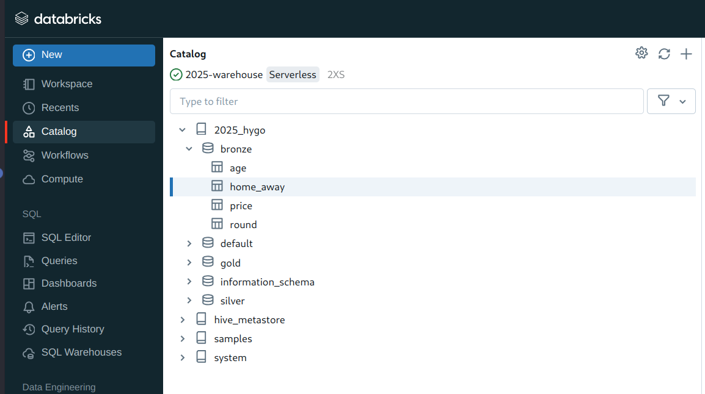
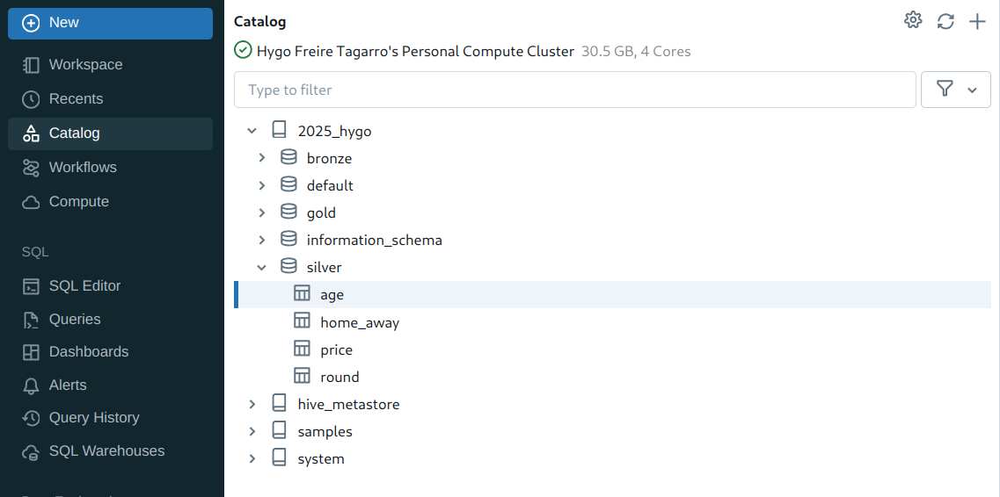

# Índice
1. [Definição do Problema](#definição-do-problema)
2. [Objetivo](#objetivo)
3. [O Projeto](#o-projeto)
   - [1. Pesquisa de Dados](#1-pesquisa-de-dados)
   - [2. Coleta de Dados](#2-coleta-de-dados)
   - [3. Plataforma para Execução das Tarefas](#3-plataforma-para-execução-das-tarefas)
   - [4. Formato e Armazenamento](#4-formato-e-armazenamento)
   - [5. Modelagem e Carregamento](#5-modelagem-e-carregamento)
     - [5.1. Criação dos Esquemas](#51-criação-dos-esquemas)
     - [5.2. Criação das Tabelas](#52-criação-das-tabelas)
     - [5.3. Extração e Carregamento de Dados para a Camada Bronze](#53-extração-e-carregamento-de-dados-para-a-camada-bronze)
   - [6. Catálogo de Dados da Camada Bronze](#6-catálogo-de-dados-da-camada-bronze)
     - [6.1. age](#61-age)
     - [6.2. home_away](#62-home_away)
     - [6.3. price](#63-price)
     - [6.4. round](#64-round)
   - [7. Transformações para a Camada Silver](#7-transformações-para-a-camada-silver)
     - [7.1. age](#71-age)
     - [7.2. home_away](#72-home_away)
     - [7.3. price](#73-price)
     - [7.4. round](#74-round)
   - [8. Catálogo de Dados da Camada Silver](#8-catálogo-de-dados-da-camada-silver)
     - [8.1. age](#81-age)
     - [8.2. home_away](#82-home_away)
     - [8.3. price](#83-price)
     - [8.4. round](#84-round)

## Definição do Problema

## Objetivo

## O Projeto

### 1. Pesquisa de Dados

A pesquisa de dados foi realizada utilizando informações disponíveis no site [Transfermarkt](https://www.transfermarkt.com), que oferece uma ampla gama de filtros para personalizar as estatísticas e classificações de clubes de futebol. Utilizei um conjunto de dados abrangente, extraído das temporadas do Campeonato Brasileiro Série A, cobrindo o período de 2006 a 2024.

**Modelagem**: Utilizei uma arquitetura do tipo [Medallion](https://www.databricks.com/glossary/medallion-architecture), onde na camada **Bronze** estão os dados crus, na camada **Silver** estão os dados processados, filtrando os campos necessários, e na camada **Gold** utilizei um modelo em esquema estrela para estruturar os dados, dada a sua eficácia na organização e análise de dados relacionais. Com a base de dados organizada em múltiplas tabelas inter-relacionadas, essa abordagem facilita a realização de consultas complexas e detalhadas, garantindo a integridade e a escalabilidade dos dados. Esse modelo permite uma análise mais profunda e estruturada das diversas métricas coletadas.

### 2. Coleta de Dados

A coleta de dados foi realizada acessando o site Transfermarkt e utilizando scripts personalizados para extrair informações detalhadas das temporadas do Campeonato Brasileiro Série A. Esta etapa foi essencial para garantir a precisão e a confiabilidade dos dados, uma vez que o Transfermarkt é amplamente reconhecido como uma fonte confiável e abrangente de estatísticas e informações sobre futebol.

O conjunto de dados abrange diversas métricas importantes, tais como:

- Idade média dos jogadores por clube e temporada
- Resultados dos jogos em casa e fora de casa por rodada
- Valor de mercado dos clubes por temporada
- Classificação e desempenho dos clubes por rodada

Essas métricas oferecem uma visão detalhada do desempenho e das características dos clubes ao longo das temporadas, facilitando análises comparativas e decisões informadas para treinadores, analistas esportivos, dirigentes de clubes e fãs de futebol.

### 3. Plataforma para Execução das Tarefas

Para este projeto, estou utilizando uma conta Databricks Premium como plataforma principal de processamento e análise de dados na nuvem. A escolha do Databricks foi baseada em suas capacidades robustas de processamento distribuído e análise de dados em grande escala.

Principais funcionalidades utilizadas:

- **Processamento Distribuído:** Permite a análise eficiente de grandes volumes de dados.
- **Integração com S3:** Facilita o armazenamento e recuperação de dados diretamente do Amazon S3.
- **Notebooks Colaborativos:** Ambiente interativo que permite a colaboração em tempo real.
- **Gerenciamento de Clusters:** Ajuste automático de recursos conforme a demanda de processamento.
- **Suporte a Delta Lake:** Garante a qualidade dos dados com transações ACID e consultas históricas.

A utilização do Databricks Premium garante que todas as etapas do projeto, desde a ingestão de dados até a análise final, sejam executadas de maneira eficiente, proporcionando uma base sólida para a geração de insights valiosos sobre o Campeonato Brasileiro Série A.

### 4. Formato e Armazenamento

Foi criado um cluster no Databricks Premium, integrado com o GitHub para versionamento de código e gerenciamento de projetos. O armazenamento e o processamento dos dados utilizam uma arquitetura do tipo Medallion, estruturada em três camadas:

- **Bronze:** Contém dados brutos, exatamente como foram extraídos das fontes.
  

- **Silver:** Contém dados limpos e transformados, prontos para análise.
  

- **Gold:** Contém dados altamente refinados e otimizados para a geração de relatórios e insights.
  
  [Espaço para imagem da camada Gold]

Essa arquitetura oferece uma abordagem estruturada e eficiente para gerenciar e processar grandes volumes de dados, assegurando escalabilidade e confiabilidade. Com o data lake centrado na arquitetura Medallion, espera-se melhorar a acessibilidade aos dados, fortalecer as capacidades analíticas e aumentar a agilidade na geração de insights para suportar decisões informadas.

### 5. Modelagem e Carregamento

#### 5.1. Criação dos Esquemas
Dentro do Databricks, por viés organizacional, é necessário criar esquemas para armazenar as tabelas de análise. Será criado um esquema para cada camada do Data Lake. Para isso, utilizamos o job [create_schemas](jobs/create_schemas.py). Este job automatiza o processo de criação dos esquemas, garantindo consistência e organização no armazenamento dos dados.

#### 5.2. Criação das Tabelas
Após a criação dos esquemas, o próximo passo é a criação das tabelas necessárias para armazenar os dados de cada camada. Utilizamos o job [create_tables](jobs/create_tables.py) para automatizar este processo, assegurando que todas as tabelas estejam corretamente configuradas.

#### 5.3. Extração e Carregamento de Dados para a Camada Bronze
Com os esquemas e tabelas configurados, o próximo passo é extrair e carregar os dados nas respectivas tabelas. Utilizamos o job [extract_data](jobs/extract_data.py) para automatizar a extração e o carregamento dos dados nas tabelas da camada Bronze. Este job garante que os dados sejam processados e carregados corretamente nas tabelas de dados brutos.

Este processo percorre algumas URLs do site e faz a extração dessas informações, salvando em arquivos dentro da pasta `data` no seguinte formato:

- Idade média dos jogadores por clube e temporada
  - `data/age/age_{year}.csv`
  - Scraper [age_scraper](data_scraper/age_scraper.py)
- Resultados dos jogos em casa e fora de casa por rodada
  - `data/home_away/home_away_{year}.csv`
  - Scraper [home_away_scraper](data_scraper/home_away_scraper.py)
- Valor de mercado dos clubes por temporada
  - `data/price/price_{year}.csv`
  - Scraper [price_scraper](data_scraper/price_scraper.py)
- Classificação e desempenho dos clubes por rodada
  - `data/round/round_{year}.csv`
  - Scraper [round_scraper](data_scraper/round_scraper.py)

As tarefas compartilhadas estão na classe [base_scraper](data_scraper/base_scraper.py).

A primeira coisa que o script faz é checar se já existe este arquivo localmente, e caso exista, ele utiliza o local. Caso contrário, ele busca a informação no site novamente. É possível forçar a atualização através da variável `force_update_years`. Uma vez com os arquivos em cache local, é populada a tabela em questão da camada bronze (age, home_away, price e round).

### 6. Catálogo de Dados da Camada Bronze

#### 6.1. age
| Coluna                      | Tipo    | Descrição                                 | Nulo | Valores Mínimos | Valores Máximos |
|-----------------------------|---------|-------------------------------------------|------|-----------------|-----------------|
| ano                         | bigint  | Ano da temporada                          | Não  | 2006            | 2024            |
| clube                       | string  | Nome do clube                             | Não  | -               | -               |
| plantel                     | bigint  | Número de jogadores no plantel            | Não  | 1               | 60              |
| jogadores_utilizados        | bigint  | Número de jogadores utilizados            | Não  | 1               | 60              |
| media_idade_plantel         | double  | Média de idade do plantel                 | Não  | 15.0            | -               |
| media_idade_time_titular    | double  | Média de idade do time titular            | Não  | 15.0            | -               |
| media_idade                 | double  | Média de idade geral                      | Não  | 15.0            | -               |

#### 6.2. home_away
| Coluna            | Tipo    | Descrição                         | Nulo | Valores Mínimos | Valores Máximos |
|-------------------|---------|-----------------------------------|------|-----------------|-----------------|
| ano               | bigint  | Ano da temporada                  | Não  | 2006            | 2024            |
| rodada            | bigint  | Rodada do jogo                    | Não  | 1               | 38              |
| clube_mandante    | string  | Nome do clube mandante            | Não  | -               | -               |
| clube_visitante   | string  | Nome do clube visitante           | Não  | -               | -               |
| gols_mandante     | string  | Gols do clube mandante            | Não  | 0               | -               |
| gols_visitante    | string  | Gols do clube visitante           | Não  | 0               | -               |
| data              | string  | Data do jogo                      | Sim  | -               | -               |
| juiz              | string  | Nome do juiz                      | Sim  | -               | -               |
| publico           | string  | Público presente                  | Sim  | 0               | -               |

#### 6.3. price
| Coluna                | Tipo    | Descrição                             | Nulo | Valores Mínimos | Valores Máximos |
|-----------------------|---------|---------------------------------------|------|-----------------|-----------------|
| ano                   | bigint  | Ano da temporada                      | Não  | 2006            | 2024            |
| clube                 | string  | Nome do clube                         | Não  | -               | -               |
| plantel               | string  | Número de jogadores no plantel        | Não  | 1               | -               |
| media_idade           | string  | Média de idade do plantel             | Não  | 15.0            | -               |
| estrangeiros          | string  | Número de jogadores estrangeiros      | Não  | 0               | -               |
| media_valor_mercado   | string  | Valor médio de mercado                | Não  | 1               | -               |
| valor_mercado_total   | string  | Valor total de mercado                | Não  | 1               | -               |

#### 6.4. round
| Coluna         | Tipo    | Descrição                                 | Nulo | Valores Mínimos | Valores Máximos |
|----------------|---------|-------------------------------------------|------|-----------------|-----------------|
| ano            | bigint  | Ano da temporada                          | Não  | 2006            | 2024            |
| rodada         | bigint  | Rodada do jogo                            | Não  | 1               | 38              |
| classificacao  | string  | Classificação do clube na rodada          | Não  | 1               | 20              |
| clube          | string  | Nome do clube                             | Não  | -               | -               |
| jogos          | string  | Número de jogos disputados                | Não  | 1               | 38              |
| vitorias       | string  | Número de vitórias                        | Não  | 0               | 38              |
| empates        | string  | Número de empates                         | Não  | 0               | 38              |
| derrotas       | string  | Número de derrotas                        | Não  | 0               | 38              |
| gols_pro       | string  | Número de gols a favor                    | Não  | 0               | -               |
| gols_contra    | string  | Número de gols contra                     | Não  | 0               | -               |
| saldo          | string  | Saldo de gols                             | Não  | -               | -               |
| pontos         | string  | Número de pontos                          | Não  | 0               | -               |

### 7. Transformações para a Camada Silver
Toda a transformação foi feita por jobs que estão na pasta `silver_transform`. A transformação é feita lendo os dados da camada bronze e salvando na camada silver.

#### 7.1. age
A transformação é feita via [age_transform](silver_transform/age_transform.py). O que foi feito:
- Conversão de tipos
- Remoção de colunas desnecessárias (plantel, jogadores_utilizados, media_idade_plantel)
- Normalização do nome dos clubes

#### 7.2. home_away
A transformação é feita via [home_away_transform](silver_transform/home_away_transform.py). O que foi feito:
- Conversão de tipos
- Remoção de colunas desnecessárias (data, juiz, publico)
- Normalização do nome dos clubes
- Tratamento das colunas gols_mandante e gols_visitante para que em caso de `adiado` o valor seja 0

#### 7.3. price
A transformação é feita via [price_transform](silver_transform/price_transform.py). O que foi feito:
- Conversão de tipos
- Remoção de colunas desnecessárias (plantel, media_idade, estrangeiros, media_valor_mercado)
- Normalização do nome dos clubes
- Tratamento das colunas media_valor_mercado e valor_mercado_total para que em caso de `K` ou `M` seja convertido para o valor correto

#### 7.4. round
A transformação é feita via [round_transform](silver_transform/round_transform.py). O que foi feito:
- Conversão de tipos
- Normalização do nome dos clubes

### 8. Catálogo de Dados da Camada Silver

#### 8.1. age
| Coluna                   | Tipo    | Descrição                              | Nulo | Valores Mínimos | Valores Máximos |
|--------------------------|---------|----------------------------------------|------|-----------------|-----------------|
| ano                      | bigint  | Ano da temporada                       | Não  | 2006            | 2024            |
| clube                    | string  | Nome do clube                          | Não  | -               | -               |
| plantel                  | bigint  | Número de jogadores no plantel         | Não  | 1               | 60              |
| media_idade_time_titular | double  | Média de idade do time titular         | Não  | 15.0            | -               |
| media_idade              | double  | Média de idade geral                   | Não  | 15.0            | -               |

#### 8.2. home_away
| Coluna            | Tipo    | Descrição                         | Nulo | Valores Mínimos | Valores Máximos |
|-------------------|---------|-----------------------------------|------|-----------------|-----------------|
| ano               | bigint  | Ano da temporada                  | Não  | 2006            | 2024            |
| rodada            | bigint  | Rodada do jogo                    | Não  | 1               | 38              |
| clube_mandante    | string  | Nome do clube mandante            | Não  | -               | -               |
| clube_visitante   | string  | Nome do clube visitante           | Não  | -               | -               |
| gols_mandante     | bigint  | Gols do clube mandante            | Não  | 0               | -               |
| gols_visitante    | bigint  | Gols do clube visitante           | Não  | 0               | -               |

#### 8.3. price
| Coluna                | Tipo    | Descrição                             | Nulo | Valores Mínimos | Valores Máximos |
|-----------------------|---------|---------------------------------------|------|-----------------|-----------------|
| ano                   | bigint  | Ano da temporada                      | Não  | 2006            | 2024            |
| clube                 | string  | Nome do clube                         | Não  | -               | -               |
| valor_mercado_euros   | double  | Valor de mercado em euros             | Não  | 1               | -               |

#### 8.4. round
| Coluna         | Tipo    | Descrição                                 | Nulo | Valores Mínimos | Valores Máximos |
|----------------|---------|-------------------------------------------|------|-----------------|-----------------|
| ano            | bigint  | Ano da temporada                          | Não  | 2006            | 2024            |
| rodada         | bigint  | Rodada do jogo                            | Não  | 1               | 38              |
| classificacao  | string  | Classificação do clube na rodada          | Não  | 1               | 20              |
| clube          | string  | Nome do clube                             | Não  | -               | -               |
| jogos          | bigint  | Número de jogos disputados                | Não  | 1               | 38              |
| vitorias       | bigint  | Número de vitórias                        | Não  | 0               | 38              |
| empates        | bigint  | Número de empates                         | Não  | 0               | 38              |
| derrotas       | bigint  | Número de derrotas                        | Não  | 0               | 38              |
| gols_pro       | bigint  | Número de gols a favor                    | Não  | 0               | -               |
| gols_contra    | bigint  | Número de gols contra                     | Não  | 0               | -               |
| saldo          | bigint  | Saldo de gols                             | Não  | -               | -               |
| pontos         | bigint  | Número de pontos                          | Não  | 0               | -               |
